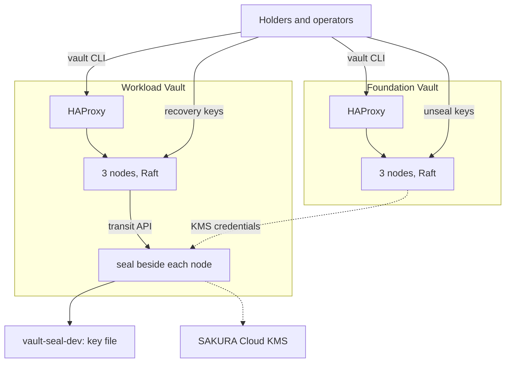

# HashiCorp Vault Sandbox

Practise running a two-tier secrets hierarchy on one Linux host, with two 3-node Vault clusters on Docker Compose, each behind an HAProxy load balancer:

| Cluster | Unsealed by | Holds |
|---|---|---|
| **Foundation Vault** (`foundation/`) | Unseal keys held by people | What it takes to rebuild everything else, including the Workload Vault's KMS credentials when it uses a cloud KMS |
| **Workload Vault** (`workload/`) | A seal beside each node that answers Vault's transit API: [vault-seal-dev](https://github.com/zinrai/vault-seal-dev) (a key file, development only), or [SAKURA Cloud KMS](https://cloud.sakura.ad.jp/products/kms/) through [vault-seal-sakura-kms](https://github.com/zinrai/vault-seal-sakura-kms) | The secrets applications use. People hold its recovery keys |



Keys reach the nodes through vault-ceremony; dashed lines apply only with SAKURA Cloud KMS, whose credentials an operator provisions from the Foundation Vault. The two clusters are on separate networks: the Workload Vault never reaches the Foundation Vault at runtime. How each part connects is in [docs/architecture.md](docs/architecture.md).

The ceremonies are run with [vault-ceremony](https://github.com/zinrai/vault-ceremony); everything else with the `vault` CLI. One shell plays every person: `decrypt <name>` is that person's own decryption, piped between two vault-ceremony commands, and `vault-ceremony status --as <name>` shows what they do next.

## Prerequisites

- Linux, with Docker and Docker Compose V2, `gpg`, and OpenSSL 3
- For SAKURA Cloud KMS instead of the development seal: a KMS key, and an API key that can use it

## Start

Put the [vault-ceremony](https://github.com/zinrai/vault-ceremony/releases) and [vault-seal-dev](https://github.com/zinrai/vault-seal-dev/releases) release binaries in `bin/` as `vault-ceremony` and `vault-seal-dev`, and [vault-seal-sakura-kms](https://github.com/zinrai/vault-seal-sakura-kms/releases) as `vault-seal-sakura-kms` to use SAKURA Cloud KMS. Then take the `vault` CLI out of the image, and set up the shell:

```bash
$ docker run --rm --entrypoint cat hashicorp/vault:2.1.1 /bin/vault > bin/vault && chmod +x bin/vault
$ . sandbox/env.sh
```

### Foundation Vault

```bash
$ cd foundation && . ./env
$ keys alice bob carol safe-hq safe-dc2
$ certs
$ docker compose up -d
$ vault-ceremony init
$ for h in alice bob carol; do vault-ceremony key --as $h | decrypt $h | vault-ceremony unseal --node foundation-0 --as $h; done
$ for h in alice bob carol; do vault-ceremony key --as $h | decrypt $h | vault-ceremony unseal --as $h; done     # again if a node has not joined yet
$ vault-ceremony initial-root-token --as alice | decrypt alice | vault-ceremony bootstrap --as alice
```

Log in as alice with their initial password:

```bash
$ decrypt alice < state/passwords/alice.asc
$ vault login -method=userpass username=alice
$ vault secrets enable -path=secret kv-v2
```

### Workload Vault

Provision its seal. The development seal's key is made here, as a file:

```bash
$ cd ../workload && . ./env
$ dev-seal
```

Or, with SAKURA Cloud KMS, store its credentials in the Foundation Vault, while still logged in there, and provision them from it: the credentials for the seals, and in `.env`, which Docker Compose reads, the seal to run and the key ID for the nodes.

```bash
$ vault kv put secret/platform/sakura-kms \
    access_token=<access token> access_token_secret=<secret> key_id=<KMS key resource ID>
$ kms() { vault kv get -field="$1" secret/platform/sakura-kms; }
$ (umask 077
   printf 'SAKURA_ACCESS_TOKEN=%s\nSAKURA_ACCESS_TOKEN_SECRET=%s\nSAKURA_KMS_KEY_ID=%s\n' \
     "$(kms access_token)" "$(kms access_token_secret)" "$(kms key_id)" > ../workload/seal.env
   printf 'WORKLOAD_SEAL=vault-seal-sakura-kms\nWORKLOAD_SEAL_KEY_NAME=%s\n' "$(kms key_id)" > ../.env)
$ cd ../workload && . ./env
```

Then start it, and initialize it. The seal unseals every node:

```bash
$ keys alice bob carol safe-hq safe-dc2
$ certs
$ docker compose --profile workload up -d
$ vault-ceremony init
$ vault-ceremony initial-root-token --as alice | decrypt alice | vault-ceremony bootstrap --as alice
```

Log in as for the Foundation Vault. `cd <cluster> && . ./env` switches between the two; log in again after switching.

### Applications

To put applications on the Workload Vault, clone [hashicorp-vault-lab](https://github.com/zinrai/hashicorp-vault-lab) here, set up the shell for it, and follow its README from there:

```bash
$ cd ../workload && . ./env
$ vault login -method=userpass username=alice
$ export VAULT_NETWORK=hashicorp-vault-sandbox_workload
$ cd ../hashicorp-vault-lab
```

## Practise

Failover, ceremonies, restore and the rest are in [docs/scenarios.md](docs/scenarios.md).

## Taking It to Production

Only the nodes change: on hosts, configuration management provides what `docker-compose.yaml` provides here. [docs/node-contract.md](docs/node-contract.md) lists it.

## License

This project is licensed under the [MIT License](./LICENSE).
