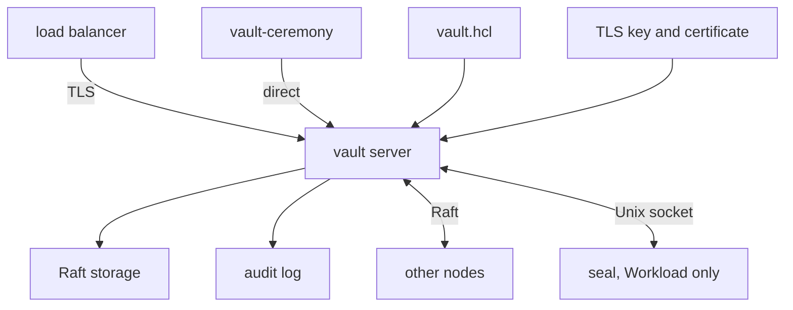
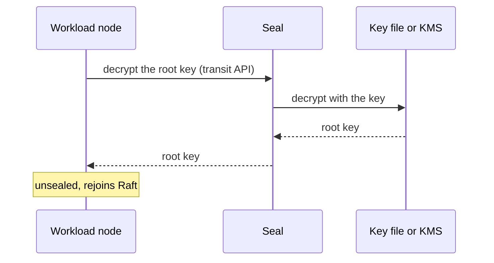
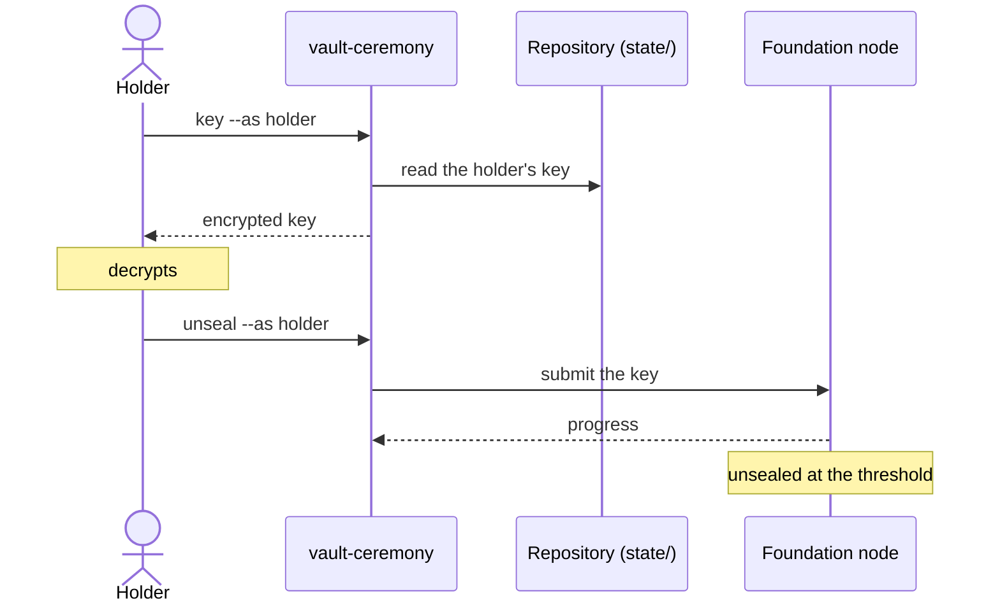
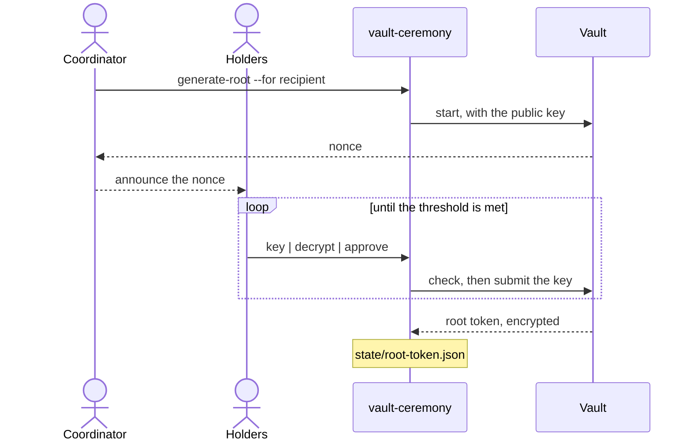

# Architecture

How the parts connect. Addresses, ports and file names are left to the configuration, which says them exactly.

## A Node

Every node is the same, apart from the seal: only Workload nodes have one. The load balancer passes TLS through and adds a PROXY header with the client's address; vault-ceremony reaches each node directly.

## A Workload Node Starts

The node cannot start while its seal is down, and unseals by itself once it is up.

## Holders Unseal a Foundation Node

Each holder in turn, until the threshold is met. The holder decrypts with their own OpenPGP tool and pipes the plaintext into `unseal`: it exists only in the pipe.

## Generating a Root Token

The same for both clusters: unseal keys in the Foundation Vault, recovery keys in the Workload Vault. Holders approve in a shell where an operator has logged in. Before submitting a key, vault-ceremony checks that the token would go to someone in `pubkeys/`; the token lands in `state/root-token.json`, and the recipient decrypts it with `root-token`.

